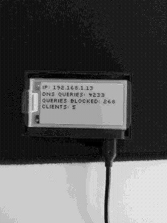

# Pi-hole setup on a Raspberry Pi Zero W

Grouping several notes and resources found online to set up a Pi-hole on a Raspberry Pi Zero W, step by step.

## Initial SD card setup

Plug your micro SD card on your machine and install Raspberry Pi OS lite. The easiest way to do this is to use the official Raspberry Pi Imager, found here: https://www.raspberrypi.org/downloads/

Unplug it and replug it for the following steps.

## Finish setting up the SD card

You should see a `Boot` folder in your SD card if Raspberry Pi OS has been installed properly. Several files need to be created and edited at the root of this directory:

```shell
touch wpa_supplicant.conf
touch ssh
```

Add the following lines to `wpa_supplicant.conf`:

```shell
ctrl_interface=DIR=/var/run/wpa_supplicant GROUP=netdev
update_config=1
country=FR # or another country, depending on yours
```

Next, run the command `wpa_passphrase <ssid-name> <password-name>` on your current machine, wrapping the parameters of your Wi-Fi connection in quotes if they contain spaces.

Copy the output of the command in `wpa_supplicant.conf`, and delete the commented_out `psk` line before saving. The last line will store your Wi-Fi password a bit more securely than plaintext.

`wpa_supplicant.conf` should now look like this:

```shell
ctrl_interface=DIR=/var/run/wpa_supplicant GROUP=netdev
update_config=1
country=US
 
network={
    ssid="YOURSSID"
    psk="YOURPASSWORD"
    scan_ssid=1 # add this line too!
}
```

Next, add the following line at the end of `config.txt` to enable troubleshooting through a USB console cable: 

`enable_uart=1`

The `ssh` file does not need to be edited and enable SSH on its own.

Unplug the micro SD card and plug it in your raspberry Pi Zero W.

## Power up and configuration

Power up your Raspberry Pi on your machine with a USB cable, by using the micro USB slot on the far right. The green LED light should show some activity, after a few minutes ping your Pi from your machine: `ping raspberrypi.local`

If this worked, you should be able to ssh to your Pi: `ssh pi@raspberrypi.local`, with `raspberry` as the default password.

Next, let's update the Pi Zero:

```shell
sudo apt update
sudo apt upgrade
```

Then change the default password to something secure with `passwd`.

If you have SSH keys on your machine, it would be much better to use them to connect to your Pi Zero rather than a password. Create a `.ssh` folder on your Pi with appropriate permissions:

```shell
mkdir ~/.ssh
chmod 700 ~/.ssh
```

Copy your public key on your machine from `~/.ssh/id_rsa.pub`, then create the file `~/.ssh/authorized_keys` on your Pi Zero and paste it inside. Run `chmod 600 ~/.ssh/authorized_keys` too to set the right permissions.

Next, edit `/etc/ssh/sshd_config` on your Pi and add or edit the following lines like the following:

```shell
PasswordAuthentication no
PubkeyAuthentication yes
ChallengeResponseAuthentication no
PermitRootLogin no
```

This will harden SSH security on your Pi and use exclusively keys to connect. Reboot with `sudo shutdown -r now` to apply changes and be done with it.

## Extend the life of your SD card

SD cards are fragile, and will fail way more often than any other kind of storage. To extend the life of your SD card a bit, you can disable swap on Raspberry Pi OS by removing the following package:

```shell
sudo apt remove dphys-swapfile
```

## Install Pi-hole

Installing Pi-hole is easy if you don't wanna review the source code first, simply run `curl -sSL https://install.pi-hole.net | bash`. Picking default options is fine.

## Use unbound for your own recursive DNS server

Follow instructions here if you wish to use unbound rather than trusting Google's DNS servers or others: https://docs.pi-hole.net/guides/unbound/

## Router settings

One of the easiest way to let your Pi-Hole become the default DNS server for all your machines is to disable DHCP on your router and let your Pi Zero handle it. Since this depends on your ISP and router model, you have to search how to disable this on your own.

It is also recommended to disable ipv6, as this can leak DNS queries that your Pi-Hole won't handle.

Once you've done that, go to pi.hole/admin and enable DHCP in settings. It might be required to reboot your Pi Zero and your router for changes to take effect.

## Optional: display stats with a Waveshare 2.13inch e-Paper HAT



Enable SPI on your Pi Zero first:

```shell
sudo raspi-config
# Choose Interfacing Options -> SPI -> Yes  to enable SPI interface
```

Reboot with `sudo shutdown -r now`.

Next, install `BCM2835` libraries:

```shell
wget http://www.airspayce.com/mikem/bcm2835/bcm2835-1.60.tar.gz
tar zxvf bcm2835-1.60.tar.gz 
cd bcm2835-1.60/
sudo ./configure
sudo make
sudo make check
sudo make install
```

Install `wiringpi` last version too:

```shell
cd /tmp
wget https://project-downloads.drogon.net/wiringpi-latest.deb
sudo dpkg -i wiringpi-latest.deb
gpio -v # should output version 2.52
```

Install related python3 libraries:

```shell
sudo apt update
sudo apt install python3-pip python3-pil python3-numpy
sudo pip3 install RPi.GPIO
sudo pip3 install spidev
```

Test if your display works with waveshare examples:

```shell
git clone https://github.com/waveshare/e-Paper
cd e-Paper/RaspberryPi\&JetsonNano/python/examples
python3 epd_2in13_V2_test.py # let it run its whole course
```

Get this font:

```shell
wget http://kottke.org/plus/type/silkscreen/download/silkscreen.zip
unzip silkscreen.zip
```

You can pick `slkscr.ttf` and ditch the rest

If you don't mind working at the root of your home folder, copy the following libraries:

```shell
cp e-Paper/RaspberryPi&JetsonNano/python/lib/waveshare_epd/epd2in13_V2.py ~
cp e-Paper/RaspberryPi&JetsonNano/python/lib/waveshare_epd/epdconfig.py ~
```

And add the following script in your home folder too, as `display.py`:

```python
#!/usr/bin/env python3

import epd2in13_V2
from PIL import Image, ImageDraw, ImageFont
import subprocess
import requests
import json
import time

epd = epd2in13_V2.EPD()
font = ImageFont.truetype('/home/pi/slkscr.ttf', 18)
api_url = 'http://localhost/admin/api.php'

image = Image.new('1', (epd.height, epd.width), 255)
draw = ImageDraw.Draw(image)

epd.init(epd.FULL_UPDATE)
epd.displayPartBaseImage(epd.getbuffer(image))
epd.init(epd.PART_UPDATE)

partial_refresh_count = 0

while True:
    try:
        try:
            r = requests.get(api_url)
            data = json.loads(r.text)
            DNSQUERIES = data['dns_queries_today']
            ADSBLOCKED = data['ads_blocked_today']
            CLIENTS = data['unique_clients']
        except:
            time.sleep(1)
            continue

        IP_cmd = "hostname -I | cut -d\' \' -f1 | tr -d \'\\n\'"
        IP = subprocess.check_output(IP_cmd, shell=True).decode("utf-8")

        draw.rectangle(([(0, 0), (epd.height, epd.width)]), fill=255)
        draw.text((0, 0), f"IP: {IP}", font=font, fill=0)
        draw.text((0, 20), f"DNS queries: {DNSQUERIES}", font=font, fill=0)
        draw.text((0, 40), f"Queries blocked: {ADSBLOCKED}", font=font, fill=0)
        draw.text((0, 60), f"Clients: {CLIENTS}", font=font, fill=0)
        epd.displayPartial(epd.getbuffer(image))
        time.sleep(30)

        partial_refresh_count += 1
        if partial_refresh_count % 10 == 0:
            epd.init(epd.FULL_UPDATE)
            epd.displayPartBaseImage(epd.getbuffer(image))
            epd.init(epd.PART_UPDATE)

    except KeyboardInterrupt:
        epd.Clear(0xFF)
        epd2in13_V2.epdconfig.module_exit()
        exit()
```

This will refresh your e-ink display entirely every 10 iterations to prevent ghosting, but still: use at your own risk. This script has not been used for a long time yet.

You can run it as a background process by running `python3 display.py`, pressing `CTRL-z` and typing `bg`.

## Maintenance

Like everything, update your Pi-Hole regularly to prevent security and performance issues.

* If you installed unbound as your own DNS server, update `root.hints` every 6 months or so:

```shell
wget -O root.hints https://www.internic.net/domain/named.root
sudo mv root.hints /var/lib/unbound/
```

* Run `sudo apt update && sudo apt upgrade` at least every week
* Run `pihole -up` every week as well
* If you restart your Pi Zero at some point, relaunch the python script to display results, as described earlier
